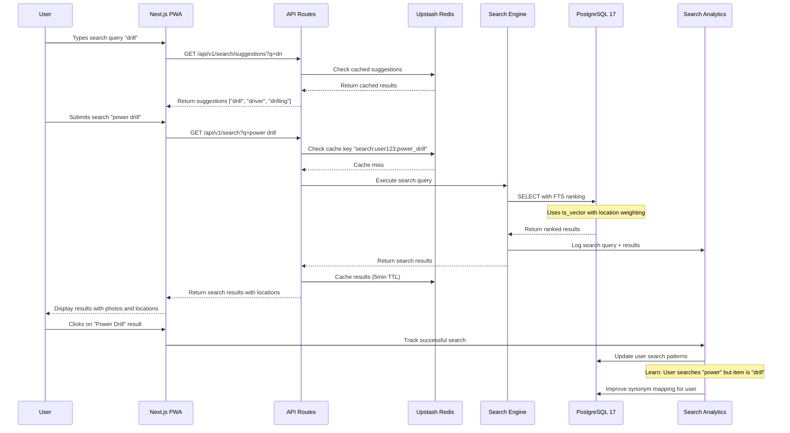
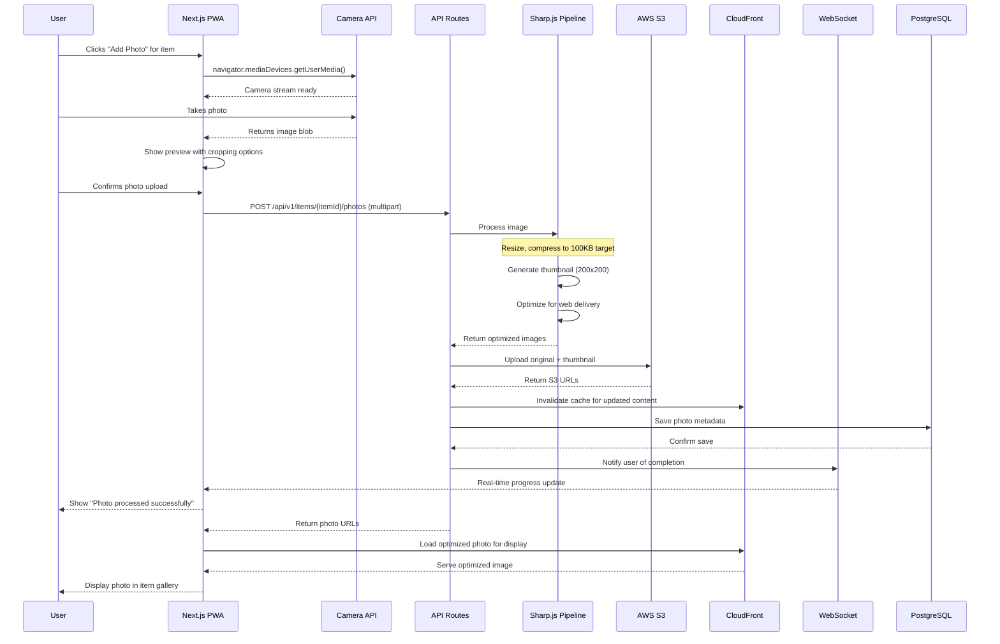
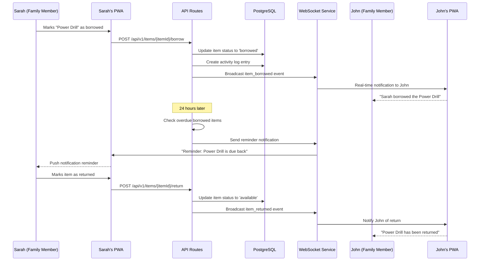
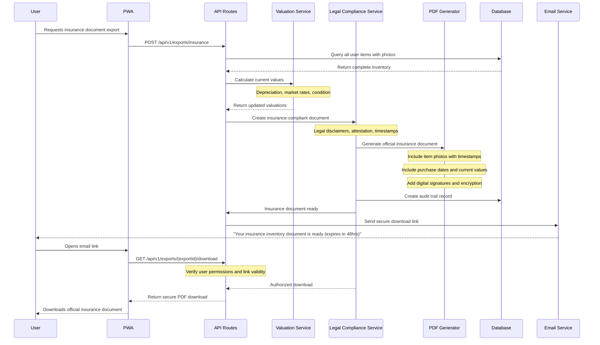

# 🔄 Core Workflows

Based on the PRD's critical user journeys and our component architecture, here are the key system workflows:

## 1. User Search Workflow - Adaptive Learning Pattern

## 2. Photo Upload Workflow - Optimized Processing Pipeline

## 3. Family Sharing Coordination Workflow

## 4. Advanced Workflow: Insurance Export & Valuation

---
