# 🏗️ High Level Architecture

The NFC-Enabled Digital Inventory Management System employs a modern **serverless-first fullstack architecture** built on Next.js 15.2 with React 19, providing a progressive web application that scales from individual households to enterprise users. The system prioritizes user experience through camera-first item addition, intelligent search with pattern learning, and adaptive organization that learns from user behavior.

## Core Architectural Principles

1. **Search-First Design**: Every interaction optimized for the core "find my stuff" value proposition
2. **Visual-Centric UX**: Camera integration, photo optimization, and visual search capabilities
3. **Adaptive Intelligence**: System learns user patterns to improve search and organization suggestions
4. **Progressive Complexity**: Starts simple, scales to advanced features as users need them
5. **Family-Friendly Sharing**: Real-time coordination with conflict resolution

## Technology Stack Overview

```mermaid
graph TB
    subgraph "Frontend Layer"
        PWA[Next.js 15.2 PWA]
        React[React 19 + Server Components]
        UI[shadcn/ui + Tailwind v4.1]
        Camera[Camera API + Sharp.js]
    end
    
    subgraph "API Layer"
        API[Next.js API Routes]
        Auth[NextAuth.js v5]
        Validation[Zod + TypeScript]
    end
    
    subgraph "Data Layer" 
        DB[(PostgreSQL 17 + FTS)]
        Cache[(Upstash Redis)]
        Storage[AWS S3 + CloudFront]
    end
    
    subgraph "External Services"
        Stripe[💳 Stripe]
        Email[📧 SendGrid]
        Monitor[📊 Sentry]
        Analytics[📈 PostHog]
    end
    
    PWA --> API
    API --> DB
    API --> Cache
    API --> Storage
    API --> Stripe
    API --> Email
    Monitor --> PWA
    Analytics --> PWA
```

## Platform and Infrastructure Choice

**Decision: Vercel + AWS Hybrid Architecture**

Platform: **Vercel (Frontend) + AWS (Backend Services)**
- Key Services: Vercel Edge Functions, AWS RDS PostgreSQL 17, AWS S3, CloudFront CDN
- Deployment: Vercel Global Edge Network, AWS us-east-1 (primary), eu-west-1 (expansion)
- Cost Target: $300/month for 10,000 active users with 50GB storage

**Why This Stack:**
1. **Next.js 15.2**: React Server Components + App Router for SEO and performance
2. **React 19**: Native form actions, concurrent features, and improved hydration
3. **PostgreSQL 17**: Superior full-text search vs NoSQL for core "find my stuff" functionality
4. **Vercel Edge**: Global CDN with serverless functions for low-latency API responses
5. **AWS Services**: Mature ecosystem for storage, database, and monitoring

---
